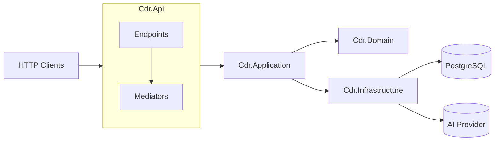

# CDR API (Clean Architecture, .NET 8)

A production‑ready backend to ingest large CDR CSVs, cleanse/standardize data, store efficiently, detect anomalous calls, and (optionally) answer simple natural‑language analytics queries.

## Features
- Streaming CSV ingestion with cleansing & validation
- PostgreSQL persistence with unique `reference` dedupe
- Strategy‑based anomaly detection (threshold, z‑score, MAD)
- Optional natural language query parser → structured JSON
- OpenAPI, ProblemDetails, Serilog, OpenTelemetry traces/metrics
- TDD with xUnit + FluentAssertions; Integration tests with WebApplicationFactory & Testcontainers
- BenchmarkDotNet for hot paths; k6 perf scripts
- Docker & Dev Container; GitHub Actions CI

## Architecture

- Clean Architecture layers: Domain (entities & rules), Application (use cases & ports), Infrastructure (EF Core, repos, external systems), Api (transport & DI).
- Patterns: Strategy (anomaly algorithms), Factory (ingest writer/AI client selection), Decorator (cross‑cutting behaviors), Specification (query filters), CQRS (commands/queries).

## Quick Start
```bash
# 1) Docker compose (Postgres + API)
docker compose up --build

# 2) Apply EF Core migrations (inside container or locally)
dotnet ef database update -p src/Cdr.Infrastructure -s src/Cdr.Api

# 3) Browse
http://localhost:8080/swagger
```

### Local (no Docker)
```bash
# set connection string
echo "ConnectionStrings__Default=Host=localhost;Port=5432;Database=cdr;Username=postgres;Password=postgres" > .env
# run API
cd src/Cdr.Api && dotnet run
```

## Key Endpoints
- `POST /api/cdr/upload` — multipart CSV upload (field: `file`). Returns `{ accepted, rejected, duplicates, durationMs, correlationId }`.
- `GET  /api/cdr/anomalies?from=2025-06-01&to=2025-06-30&strategy=zscore&z=3` — list anomalies & metrics.
- `GET  /api/cdr/query?q=how many calls did 01234 567890 make last week` — structured JSON answer (no raw LLM text).

## Config
- `ASPNETCORE_ENVIRONMENT` (Development/Production)
- `ConnectionStrings:Default` (Postgres)
- `Ingestion:BatchSize` (default 5000)
- `Anomaly:DefaultStrategy` (threshold|zscore|mad)

## Testing
```bash
dotnet test --collect:"XPlat Code Coverage" -- DataCollectionRunSettings.DataCollectors.DataCollector.Configuration.Format=cobertura
```

## Benchmarks
```bash
cd tests/Cdr.Benchmarks
dotnet run -c Release
```

## Security/Privacy
- Input validation and size limits on upload
- PII never logged; structured logging; ProblemDetails errors
- Secrets via User‑Secrets (dev) or env vars/KeyVault in prod

## Observability
- OpenTelemetry traces/metrics/logs wired; health endpoints `/health` and `/ready`

## License
MIT